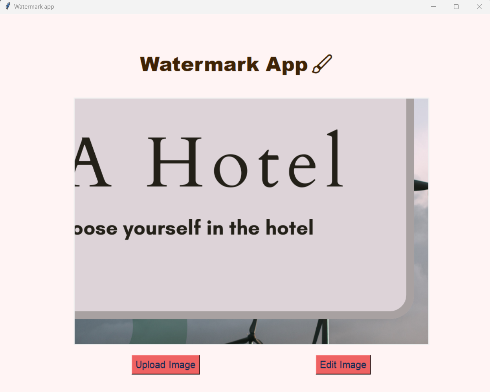
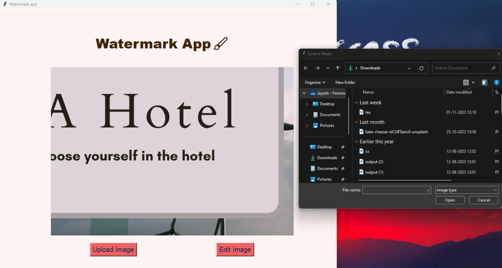
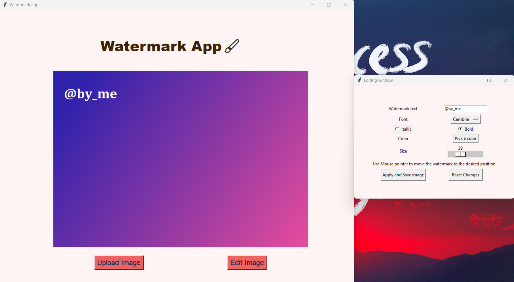
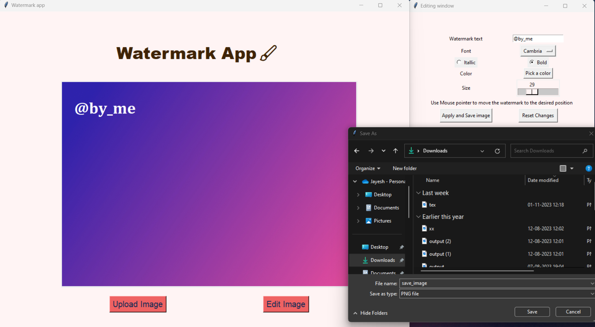

# Watermark Desktop App 🖼️

## Description 📝
The Watermark Desktop App is a Python application built using the Tkinter module for creating and editing watermarks on images. This app allows users to upload images and apply various watermarking options, including text watermark customization, font selection, font size, style, color, and precise placement on the image using mouse drag. 🌟

## Features ✨

### Image Upload 📷

- Users can upload an image for watermarking. The app provides a file dialog to select the image file when clicked on image upload button. 🖼️

### Text Watermark 🖋️

- Users can add a text watermark to the image with the following customization options:
  - Font Selection: Choose from a list of available fonts using drop down menu.
  - Font Size Selection: Set the font size for the watermark using a Scale.
  - Font Style: Customize the font style by making it bold or italic using radio button.
  - Font Color: Choose the color for the text watermark. 🎨

### Precise Placement 🎯

- The app allows users to adjust the position of the text watermark on the image using mouse drag. This feature ensures precise placement of the watermark. 🖱️

### Saving and Reverting Changes 💾

- Save Edits: After customizing the watermark to your liking, you can click the "Save" button to preserve the edited image with the watermark.

- Reset to Original: If you decide not to proceed with the watermark changes, you have the option to reset the image to its original state, undoing any edits made. ↩️

## Usage 🚀

1. Run the Watermark Desktop App by executing the Python script.
2. Use the "Upload Image" button to select the image you want to watermark.
3. Customize the text watermark by selecting a font, font size, style, and color using "Edit Image" button.
4. Drag and drop the text watermark to the desired position on the image.
5. Save the watermarked image using the "Apply and Save Image" button. 💾

## Requirements 🛠️

- Python 3.x
- Tkinter (usually included with Python)
- PIL (Python Imaging Library): Used for image processing, including adding watermarks. (You can install PIL using pip: pip install pillow) 🐍

## Working of App 🖥️:

### Interface 🖼️:

### Upload 📷:

### Edit 🖋️:

### Save 💾:

